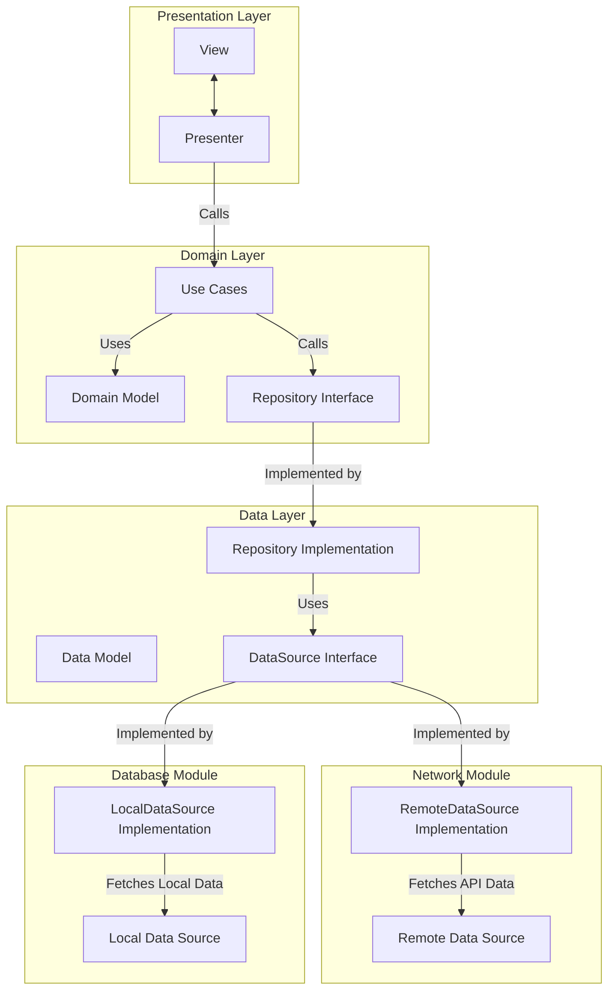

# Projectx

This repository is a template for Android projects adhering clean architecture principle.

```mermaid
graph TD;
    subgraph "Presentation Layer"
        B1[View]
        B2[Presenter]
    end
        B1 <--> B2

    subgraph "Domain Layer"
        C1[Use Cases]
        C2[Domain Model]
        C3[Repository Interface]
    end
        C1 -->|Uses| C2
        C1 -->|Calls| C3
        B2 -->|Calls| C1

    subgraph "Data Layer"
        D1[Repository Implementation]
        D2[Data Model]
        D3[DataSource Interface]
    end
        C3 -->|Implemented by| D1
        D1 -->|Uses| D3

    subgraph "Network Module"
        N1[Remote Data Source]
        N2[RemoteDataSource Implementation]
    end
        D3 -->|Implemented by| N2
        N2 -->|Fetches API Data| N1

    subgraph "Database Module"
        DB1[Local Data Source]
        DB2[LocalDataSource Implementation]
    end
        D3 -->|Implemented by| DB2
        DB2 -->|Fetches Local Data| DB1
```
